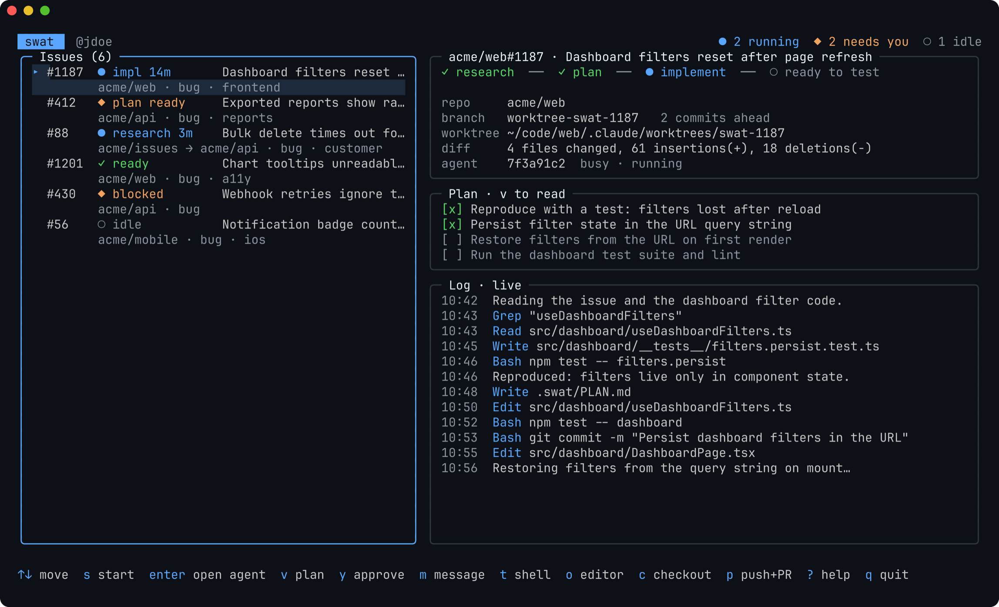
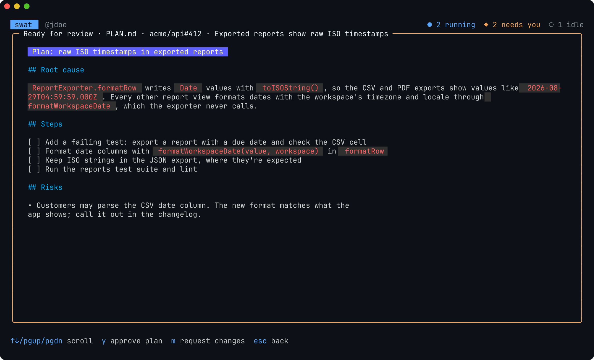
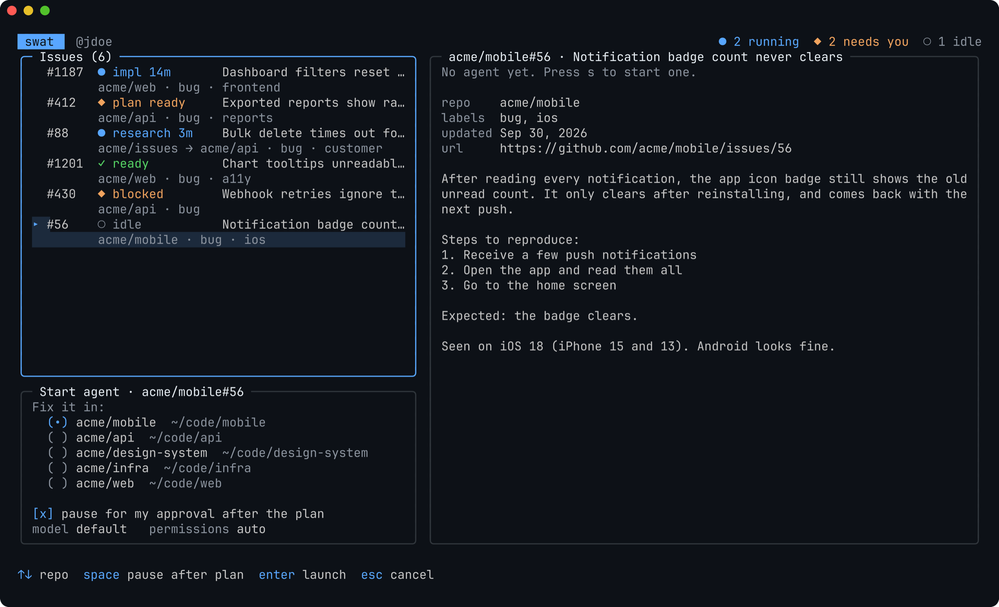
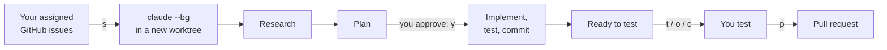

<div align="center">

# swat

**Send Claude Code agents after the GitHub issues assigned to you.**

[](https://github.com/keenanlk/swat/actions/workflows/ci.yml)
[](https://github.com/keenanlk/swat/releases)
[](go.mod)
[](LICENSE)



</div>

swat is a terminal dashboard for the bugs on your plate. It lists the open
GitHub issues assigned to you, and with one key sends a
[Claude Code](https://docs.claude.com/en/docs/claude-code) agent after any of
them. Each agent works in **its own git worktree on its own branch**: it
researches the bug, writes a plan, waits for your approval if you want, then
makes the fix, runs the tests, and commits. Run several at once, keep working
in your own checkout, and step in only when an agent needs you.

## Features

- **Your issues, everywhere.** Searches all of GitHub for open issues
  assigned to you. Narrow it down with any GitHub search qualifier
  (`org:acme label:bug`).
- **Parallel agents, isolated.** Each agent gets a fresh worktree and branch,
  so agents never step on each other or on your uncommitted work.
- **Plan first.** Agents write a root-cause analysis and a checklist before
  touching code. Read it, approve it, or send feedback without leaving the
  dashboard.
- **Live progress.** See every agent's stage, plan checklist, commits, diff
  size and a live log of what it's reading, editing and running.
- **Test and ship fast.** Open a shell or your editor in an agent's
  worktree, check its branch out in your main clone, or push it and open a
  pull request.
- **Built for teams.** Commit a `.swat.json` to tell swat where a repo's
  issues come from and what agents should know about the project.
- **Zero config.** It finds your clones, your editor and your terminal on its
  own. `swat doctor` checks the rest.

<table>
<tr>
<td width="50%"></td>
<td width="50%"></td>
</tr>
<tr>
<td align="center"><sub><b>Review the plan</b> before any code changes</sub></td>
<td align="center"><sub><b>Start an agent</b> in the right repo</sub></td>
</tr>
</table>

## Install

**Homebrew** (macOS and Linux):

```sh
brew install --cask keenanlk/tap/swat
```

**Go** 1.24+:

```sh
go install github.com/keenanlk/swat@latest
```

Or download a binary from the [releases page](https://github.com/keenanlk/swat/releases).

### Requirements

- [Claude Code](https://docs.claude.com/en/docs/claude-code), logged in.
  swat uses its background agents (`claude --bg`), so update with
  `claude update` if yours is old.
- GitHub access: [`gh auth login`](https://cli.github.com), or a `GITHUB_TOKEN`.
- git, and local clones of the repos you fix bugs in.

## Quick start

```sh
swat doctor   # checks Claude Code, GitHub, git, and your clones
swat          # opens the dashboard
```

1. Select an issue and press **`s`**. Pick the clone to fix it in, then press **`enter`**.
2. When it shows **`◆ plan ready`**, press **`v`** to read the plan and **`y`** to approve it.
3. When it shows **`✓ ready`**, press **`t`** for a shell in the agent's worktree and try the fix.
4. Press **`p`** to push the branch and open a pull request.

Press **`?`** in the dashboard for every key, or read [Using the dashboard](docs/usage.md).

## How it works



swat doesn't run models itself. It's a dashboard over Claude Code's
background sessions and git worktrees, so agents use your own Claude Code
login, settings, `CLAUDE.md` files and permissions. Agents are instructed
never to push or open pull requests; shipping is your call, with `p`. For the exact commands
swat runs and every file it touches, see [How it works](docs/how-it-works.md).

## Configuration

None is needed. When you want to change something:

```sh
swat config                          # every setting, its value, and where it comes from
swat config set permissionMode auto  # let agents work without stopping for permissions
swat config set query "org:acme"     # only show issues from one org
swat config edit                     # edit the config file (comments allowed)
swat repos add ~/work/api            # offer a clone outside the usual folders
```

For teams, commit a `.swat.json` to a repo. Run `swat init` to create one:

```json
{
  "issueRepos": ["acme/issues"],
  "instructions": "Run `make test` and `make lint` before committing."
}
```

`issueRepos` tells swat which issue-tracker repos this repo fixes bugs for,
and `instructions` are added to every agent prompt.

## Documentation

|  |  |
|---|---|
| [**Getting started**](docs/getting-started.md) | Install, requirements, and your first agent |
| [**Using the dashboard**](docs/usage.md) | Every key, every status, and how to test and ship fixes |
| [**Configuration**](docs/configuration.md) | Every setting, with recipes for common setups |
| [**Project settings**](docs/project-config.md) | `.swat.json` for your team's repos |
| [**Troubleshooting**](docs/troubleshooting.md) | Fixes for common problems |
| [**How it works**](docs/how-it-works.md) | The commands swat runs and the files it touches |

The same guides are built into the binary: `swat help <topic>`.

## FAQ

**Does swat send my code anywhere?**
No. swat itself only talks to GitHub: the API to read your issues, and your
git remote when you press `p` to push. Agents are ordinary Claude Code
sessions, so your code goes wherever your Claude Code setup sends it, exactly
as when you run `claude` yourself.

**What does it cost?**
swat is free. Each agent is a Claude Code session and counts toward your
Claude plan or API usage like any other session. Pausing for plan approval
(the default) stops wasted work on bugs an agent has misunderstood.

**Can agents break my checkout?**
Agents work in separate worktrees under `.claude/worktrees/` and are
instructed to stay there, within the permissions you give Claude Code. swat
only changes your main clone when you press `c` to check out an agent's
branch.

**Does it work with GitLab, Linear or Jira?**
Not yet; issues come from GitHub. Clones must have a github.com `origin`.

## Contributing

Issues and pull requests are welcome.

```sh
go test ./...               # unit tests
go run .                    # run from source
./scripts/screenshots.sh    # regenerate the README screenshots (needs charmbracelet/freeze)
```

The screenshots are rendered from the real UI with demo data
(`screenshots_test.go`), so regenerate them after changing the interface.

## License

[MIT](LICENSE)
